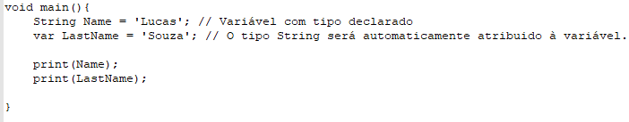
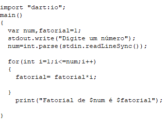
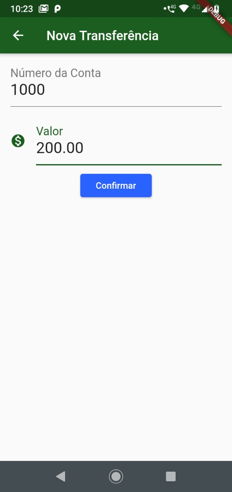
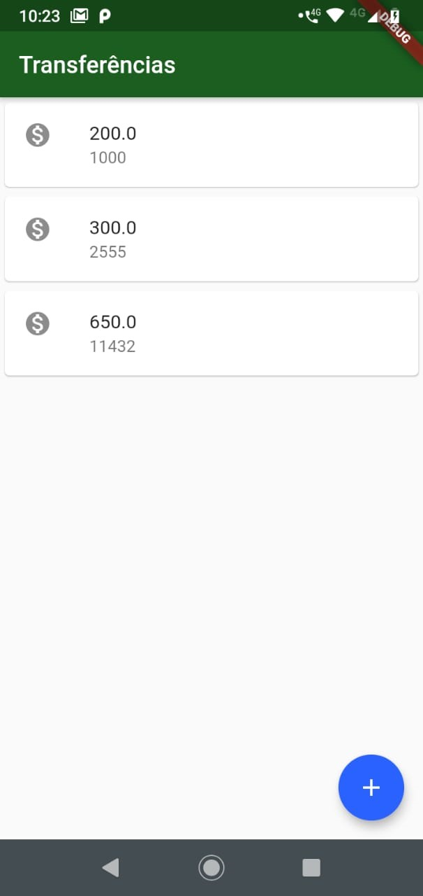

# Artigo I - Estruturas de Linguagem 

## Lucas Candido de Souza
## Pedro Rainho Pagani

### Dart - Flutter

#### Introdução.:

Originalmente chamada de Dash, **Dart** é uma linguagem de script, voltada para web, e desenvolvida pelo Google. Lançada em 2011, teve o objetivo inicial de substituir o **JavaScript** como linguagem principal usada em navegadores. É principalmente usada para desenvolver aplicativos para plataformas mobile, desktop e web.
Inicialmente, Dart teve uma recepção mista e a iniciativa foi criticada por alguns devido aos planos de incluir uma Virtual Machine no Chrome. Esses planos foram retirados em 2015 com o lançamento do Dart 1.9, focado na compilação de Dart para JavaScript.
O lançamento recente do Dart 2.6 foi acompanhado pela extensão _dart2native_. Com essa extensão, torna-se possível escrever um programa Dart em executáveis independentes. Portanto, de acordo com os representantes da Google, não é obrigatório possuir o SDK instalado.
Essa extensão recente também é integrada ao _Flutter toolkit_, que possibilita o uso do compilador em pequenos serviços. Já **Flutter** é um SDK de código aberto criado pela Google. É usado para desenvolver aplicativo para Android, iOS, Windows, Mac, Linux, Google Fuchsia e Web.

#### Influências.:

Descendendo da família de linguagens **ALGOL**, juntamente com C, Java, C# e JavaScript. A sintaxe em cascata fornece um atalho para a chamada de vários métodos um após o outro no mesmo objeto, bem como em Smalltalk. 
Seus _Mixins_ (classe que contém métodos para uso por outras classes sem precisar ser a classe pai), foram influenciados por Strongtalk e Ruby.
Dart também faz uso de _Isolates_, inspirado no _Actor Model_, implementado em Erlang.

#### Classificação.:

Quanto ao nível da linguagem. Dart é considerada uma linguagem de **alto nível** por ter sido projetada especialmente para o usuário, devido a sua facilidade de escrita, legibilidade do código, capacidade de abstração e recursos. Em termos de paradigma, Dart é classificado como uma linguagem **Multi-Paradigma** , contendo características de uma linguagem **Imperativa** e **Orientada a Objeto**.
Além de ser uma linguagem **Compilada**, devido ao processo de verificação do tipo de um programa basear-se em uma analise do código fonte, o Dart também é considerado uma linguagem **Estática**.

#### Exemplos para Familiarização.:

##### Forma simples de atribuição de variáveis automática:



##### Cálculo do fatorial de um número:



#### Exemplo Expressivo.:

O Programa consiste em uma Simulação de **Transferência Bancária**; o **Flutter** mostra a tela da Lista de Transferências. Apertando o botão azul na parte de baixo a tela do Formulário de Transferências é mostrada, onde o Usuário digita o **Número da Conta** e o **Valor da Transferência** desejados; ao confirmar, o Usuário retorna à tela da Lista, onde a Transferência criada vai ser adicionada dinamicamente á lista.

##### Telas do Programa.:

###### Lista de Transferências:



###### Formulário de Transferências:



##### Código-Fonte.:

###### main.dart

```

import 'package:flutter/material.dart';
import 'Screens/lista_transferencia.dart';

void main() => runApp(BytebankApp());

class BytebankApp extends StatelessWidget{
  @override
  Widget build(BuildContext context) {
    return MaterialApp(
      home: ListaTransferencias(),
      theme: ThemeData(
        primaryColor: Colors.green[900],
        accentColor: Colors.blueAccent[700],
        buttonTheme: ButtonThemeData(
          buttonColor: Colors.blueAccent[700],
          textTheme: ButtonTextTheme.primary,
        ),
      ),
    );
  }

}

```

###### lista_transferencia.dart

```

import 'package:flutter/material.dart';
import 'formulario_transferencia.dart';

class ListaTransferenciasState extends State<ListaTransferencias> {

  @override
  Widget build(BuildContext context) {
    return Scaffold(
      appBar: AppBar(
          title: Text('Transferências', textDirection: TextDirection.ltr,)
      ),
      body: ListView.builder(
        itemCount: widget._transferencias.length,
        itemBuilder: (context, indice){
          final transferencia = widget._transferencias[indice];
          return ItemTransferencia(transferencia);
        },

      ),
      floatingActionButton: FloatingActionButton(
        child: Icon(Icons.add),
        onPressed: (){
          final Future<Transferencia> future = Navigator.push(context, MaterialPageRoute(builder: (context){
            return FormularioTransferencia();
          }));
          future.then((transferenciaRecebida){
            if(transferenciaRecebida != null) {
              setState(() {
                widget._transferencias.add(transferenciaRecebida);
              });
            }
          });
        },
      ),
    );
  }

}

class ListaTransferencias extends StatefulWidget{

  final List<Transferencia> _transferencias = List();

  @override
  State<StatefulWidget> createState() {
    return ListaTransferenciasState();
  }

}


class ItemTransferencia extends StatelessWidget{

  final Transferencia _transferencia;

  ItemTransferencia(this._transferencia);

  @override
  Widget build(BuildContext context) {
    return Card(
      child: ListTile(
        leading: Icon(Icons.monetization_on),
        title: Text(_transferencia.valor.toString()),
        subtitle: Text(_transferencia.numeroConta.toString()),
      ),
    )
    ;
  }
}

```

###### formulario_transferencia.dart

```

import 'package:flutter/material.dart';

class Editor extends StatelessWidget {

  final TextEditingController controller;
  final String rotulo;
  final String dica;
  final IconData icone;
  Editor({this.controller, this.rotulo, this.dica, this.icone});

  @override
  Widget build(BuildContext context) {
    return Padding(
      padding: EdgeInsets.fromLTRB(16.0, 8.0, 16.0, 8.0),
      child: TextField(
        style: TextStyle(
          fontSize: 24.0,
        ),
        controller: controller,
        decoration: InputDecoration(
          icon: icone != null ? Icon(icone) : null,
          labelText: rotulo,
          hintText: dica,
        ),
        keyboardType: TextInputType.number,
      ),
    );
  }
}

class Transferencia{

  final double valor;
  final int numeroConta;

  Transferencia(this.valor, this.numeroConta);
}


class FormularioTransferenciaState extends State<FormularioTransferencia>{
  final TextEditingController _controllerCampoNumeroConta = TextEditingController();
  final TextEditingController _controllerCampoValor = TextEditingController();
  @override
  Widget build(BuildContext context) {
    return Scaffold(
      appBar: AppBar(
        title: Text('Nova Transferência', textDirection: TextDirection.ltr,),
      ),
      body: SingleChildScrollView(
        child:Column(
          children: <Widget>[
            Editor(controller: _controllerCampoNumeroConta, rotulo: 'Número da Conta', dica: '1000', icone: null),
            Editor(controller: _controllerCampoValor, rotulo: 'Valor', dica: '0.00', icone: Icons.monetization_on),
            RaisedButton(
              child: Text('Confirmar'),
              onPressed: () => _criaTransferencia(_controllerCampoNumeroConta.text, _controllerCampoValor.text, context),
            )
          ],
        ),
      ),
    );
  }
}

class FormularioTransferencia extends StatefulWidget{

  @override
  State<StatefulWidget> createState() {
    // TODO: implement createState
    return FormularioTransferenciaState();
  }
}

void _criaTransferencia(numeroCT, valorTF, BuildContext context){
  final int numeroConta = int.tryParse(numeroCT);
  final double valor = double.tryParse(valorTF);

  if(numeroConta != null && valor != null){
    final transferenciaCriada = Transferencia(valor, numeroConta);
    Navigator.pop(context, transferenciaCriada);
  }
}

```


